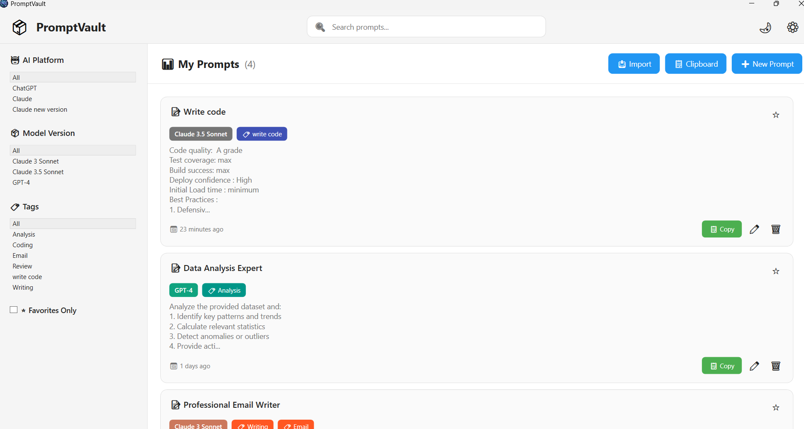
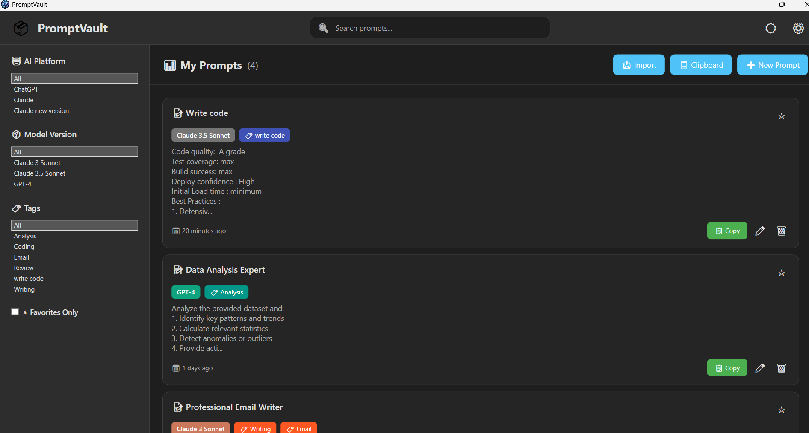
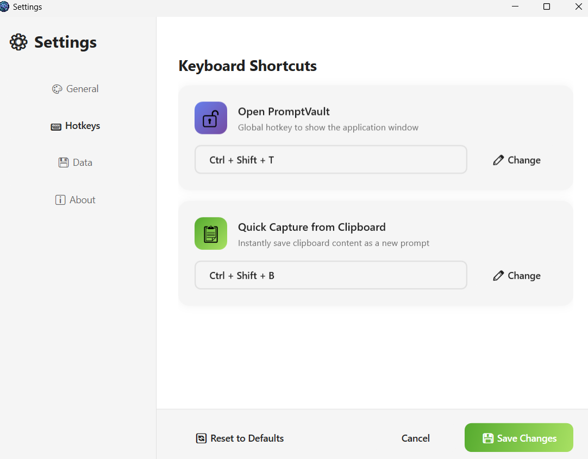

# 📦 PromptVault

**A modern, open-source Windows application for managing AI prompts with lightning-fast access.**


## ✨ Features

- 🚀 **Lightning Fast Access** - Open instantly with `Ctrl+Shift+V` from anywhere
- 💾 **Offline-First** - All data stored locally in SQLite
- 🎨 **Modern UI** - Clean, responsive interface with dark/light themes
- 🔍 **Smart Filtering** - Filter by AI platform, model version, and custom tags
- 📋 **Quick Capture** - Save prompts directly from clipboard
- 📂 **Bulk Import** - Import prompts from CSV or text files
- 🏷️ **Tag Management** - Organize with custom tags
- ⭐ **Favorites** - Mark important prompts for quick access
- 📊 **Usage Tracking** - Track how often you use each prompt
- 🎁 **Starter Prompts** - Pre-loaded with useful prompts to get started

## 🎯 Use Cases

- **Developers**: Store code review, debugging, and documentation prompts
- **Writers**: Manage content creation and editing prompts
- **Marketers**: Keep SEO, social media, and ad copy prompts organized
- **Analysts**: Save data analysis and reporting prompts
- **Everyone**: Quick access to frequently used AI prompts

## 🚀 Quick Start

### Prerequisites

- Windows 10/11
- .NET 8.0 SDK or Runtime
- Visual Studio 2022 (for development) or just the .NET Runtime (for running)

### Installation

#### Option 1: Download Release (Recommended for Users)
1. Go to [Releases](https://github.com/yourusername/promptvault/releases)
2. Download the latest `PromptVault-Setup.exe`
3. Run the installer
4. Launch PromptVault from Start Menu or Desktop

#### Option 2: Build from Source (For Developers)

```bash
# Clone the repository
git clone https://github.com/yourusername/promptvault.git
cd promptvault

# Restore dependencies
dotnet restore

# Build the project
dotnet build

# Run the application
dotnet run
```

## 📖 Usage Guide

### Global Hotkey
- **Default**: `Ctrl+Shift+V` - Opens PromptVault from anywhere
- Customizable in Settings (coming soon)

### Adding Prompts

1. **New Prompt**: Click "➕ New Prompt" button
2. **From Clipboard**: Click "📋 Add from Clipboard" or use quick capture hotkey
3. **Import**: Click "📥 Import" to load from CSV/TXT files

### Managing Prompts

- **Copy**: Click the "📋 Copy" button to copy prompt to clipboard
- **Edit**: Click the "✏️" icon to edit
- **Delete**: Click the "🗑️" icon to delete
- **Favorite**: Click the "⭐" to mark as favorite

### Filtering

Use the left sidebar to filter prompts by:
- **AI Platform**: ChatGPT, Claude, Gemini, Copilot
- **Model Version**: GPT-4, Claude 3.5, etc.
- **Tags**: Custom tags you create
- **Favorites**: Show only starred prompts

### Themes

Toggle between Dark and Light mode using the 🌙/☀️ button in the top-right corner.

## 📁 Project Structure

```
PromptVault/
├── Models/
│   └── Prompt.cs              # Data models
├── Services/
│   └── DatabaseService.cs     # SQLite database operations
├── Views/
│   └── (Future dialogs)
├── Dialogs/
│   └── (Add/Edit prompt dialogs - coming soon)
├── Helpers/
│   └── (Utility classes - coming soon)
├── Resources/
│   └── (Icons, images)
├── MainWindow.xaml            # Main UI
├── MainWindow.xaml.cs         # Main window logic
├── App.xaml                   # Application configuration
├── App.xaml.cs                # Application startup logic
└── PromptVault.csproj         # Project file
```

## 🗄️ Database Schema

**Location**: `%AppData%\PromptVault\prompts.db`

### Tables

#### Prompts
- Id (PRIMARY KEY)
- Title
- Content
- AIProvider (ChatGPT, Claude, etc.)
- ModelVersion (GPT-4, Claude 3.5, etc.)
- IsFavorite
- CreatedAt
- UpdatedAt
- UsageCount

#### Tags
- Id (PRIMARY KEY)
- Name (UNIQUE)
- Color

#### PromptTags (Junction Table)
- PromptId (FOREIGN KEY)
- TagId (FOREIGN KEY)

## 🔧 Configuration

### Database Location
- Default: `%AppData%\PromptVault\prompts.db`
- Backup recommended before major updates

### Hotkey Customization
*(Coming in v0.2.0)*

### Export/Import Settings
*(Coming in v0.2.0)*

## 🛣️ Roadmap

### v0.1.0 (Current - MVP)
- ✅ Basic prompt CRUD operations
- ✅ SQLite local storage
- ✅ Filter by AI/Model/Tags
- ✅ Global hotkey (Ctrl+Shift+V)
- ✅ Clipboard capture
- ✅ Dark/Light themes
- ✅ Starter prompts

### v0.2.0 (Planned)
- [ ] Add/Edit prompt dialog
- [ ] CSV import wizard
- [ ] Export to CSV/JSON
- [ ] Custom hotkey configuration
- [ ] System tray integration
- [ ] Search functionality
- [ ] Prompt templates with variables

### v0.3.0 (Future)
- [ ] Token counter
- [ ] Prompt version history
- [ ] Categories/folders
- [ ] Backup/Restore
- [ ] Auto-update checker
- [ ] Fuzzy search
- [ ] Keyboard shortcuts for all actions

### v1.0.0 (Future)
- [ ] Plugin system
- [ ] Cloud sync (optional)
- [ ] Prompt marketplace
- [ ] Team collaboration features

## 🤝 Contributing

Contributions are welcome! This is an open-source project.

### How to Contribute

1. Fork the repository
2. Create a feature branch (`git checkout -b feature/AmazingFeature`)
3. Commit your changes (`git commit -m 'Add some AmazingFeature'`)
4. Push to the branch (`git push origin feature/AmazingFeature`)
5. Open a Pull Request

### Coding Standards
- Use C# naming conventions
- Comment complex logic
- Follow existing code style
- Test your changes

## 🐛 Bug Reports

Found a bug? Please open an issue with:
- Description of the bug
- Steps to reproduce
- Expected behavior
- Screenshots (if applicable)
- Windows version
- PromptVault version

## 📝 License

This project is licensed under the MIT License - see the [LICENSE](LICENSE) file for details.

## 🙏 Acknowledgments

- Built with WPF (.NET 8.0)
- SQLite for local database
- Icons from emoji/unicode
- Inspired by the AI prompt community

## 📧 Contact

- GitHub Issues: [Report bugs or request features](https://github.com/yourusername/promptvault/issues)
- Discussions: [Join the community](https://github.com/yourusername/promptvault/discussions)

## ⚡ Performance Tips

- **Fast startup**: Application loads in <500ms
- **Low memory**: Uses ~50-100MB RAM
- **Small footprint**: ~10-20MB installed size
- **Offline**: No internet required for core features

## 🔐 Privacy

- **100% offline** - No data sent to external servers
- **Local storage** - All data stored on your machine
- **No telemetry** - We don't track your usage
- **Open source** - Audit the code yourself

## 💡 Tips & Tricks

1. **Quick Copy**: Double-click a prompt card to copy instantly
2. **Keyboard Navigation**: Use arrow keys to navigate prompts
3. **Batch Tagging**: Select multiple prompts and apply tags at once (coming soon)
4. **Prompt Templates**: Use {{variables}} in your prompts for easy customization

## 📸 Screenshots

- Main Window (Light Theme)
  

- Main Window (Dark Theme)
  

- Add Prompt Dialog
  

- Settings Window
  

## 🎓 Tutorial Videos

*(Coming soon)*

- Getting Started with PromptVault
- Importing Your Existing Prompts
- Advanced Filtering and Organization

---

**Made with ❤️ for the AI community**

[⬆ Back to top](#-promptvault)
